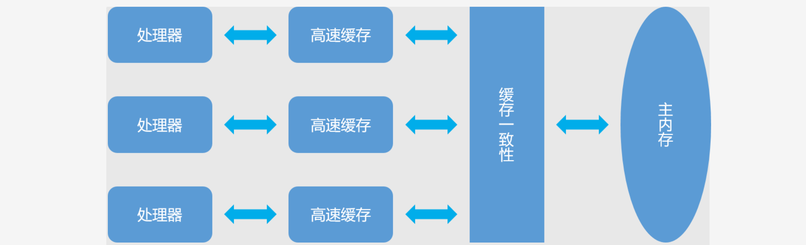

## JavaWeb 笔记

### e.printStackTrace()
你想了解 Java 中 `e.printStackTrace();` 这个方法的作用、用法和相关注意事项，我会从新手的角度，由浅入深地为你讲解。

### 一、核心概念：`printStackTrace()` 是什么？
`printStackTrace()` 是 Java 中 `Throwable` 类（所有异常/错误的父类，比如 `Exception`、`Error`）的一个实例方法，核心作用是**打印异常的完整调用栈信息**，包括：
1. 异常的类型（比如 `NullPointerException`）；
2. 异常的详细描述信息（比如 "空指针访问"）；
3. 异常发生的代码位置（类名、方法名、行号）；
4. 方法调用的链路（从程序入口到异常发生处的所有调用层级）。

简单来说，它就是程序员排查异常的 "调试利器" —— 能告诉你「哪里错了、为什么错、错误是怎么一步步发生的」。

### 二、基础用法示例
先看一个简单的代码示例，直观感受它的效果：
```java
public class PrintStackTraceDemo {
    public static void main(String[] args) {
        try {
            // 故意制造一个空指针异常
            String str = null;
            str.length(); // 这里会抛出 NullPointerException
        } catch (NullPointerException e) {
            // 打印异常的完整调用栈
            e.printStackTrace();
        }
    }
}
```

#### 运行结果（控制台输出）：
```
java.lang.NullPointerException
    at PrintStackTraceDemo.main(PrintStackTraceDemo.java:7)
```
这个输出的含义：
- 第一行：异常类型是 `NullPointerException`（空指针异常）；
- 第二行：异常发生在 `PrintStackTraceDemo` 类的 `main` 方法中，第 7 行代码。

#### 复杂场景示例（多层方法调用）：
```java
public class PrintStackTraceDemo {
    public static void main(String[] args) {
        try {
            methodA();
        } catch (Exception e) {
            e.printStackTrace();
        }
    }

    public static void methodA() {
        methodB();
    }

    public static void methodB() {
        // 制造异常
        int a = 1 / 0; // 算术异常：除以 0
    }
}
```

#### 运行结果：
```
java.lang.ArithmeticException: / by zero
    at PrintStackTraceDemo.methodB(PrintStackTraceDemo.java:15)
    at PrintStackTraceDemo.methodA(PrintStackTraceDemo.java:11)
    at PrintStackTraceDemo.main(PrintStackTraceDemo.java:5)
```
这个输出清晰展示了调用链路：`main()` → `methodA()` → `methodB()`，最终在 `methodB()` 的第 15 行抛出了算术异常。

### 三、关键注意事项（新手必看）
1. **输出位置**：默认输出到「标准错误流（System.err）」，而不是普通控制台输出（System.out），所以在控制台中通常会显示为红色（不同 IDE 样式不同），且不会被 `System.out.println()` 的输出顺序影响。
2. **生产环境慎用**：
    - `printStackTrace()` 只是把信息打印到控制台，无法持久化（比如存到日志文件），生产环境中看不到控制台输出，排查问题会很困难；
    - 推荐替代方案：使用日志框架（如 `log4j`、`slf4j`、`logback`），比如 `logger.error("发生异常", e);`，既会打印调用栈，又能把日志存到文件里。
3. **性能影响**：生成调用栈信息需要遍历方法调用链路，高频异常场景下频繁调用 `printStackTrace()` 会有轻微性能损耗（新手阶段可暂时忽略，重点关注排查问题）。
4. **不处理异常**：`printStackTrace()` 只是「打印异常信息」，并不会「处理异常」—— 异常依然会终止当前代码流程（除非用 `try-catch` 捕获）。

### 四、常见替代写法
如果不想用 `printStackTrace()`，还可以通过以下方式获取调用栈信息：
```
catch (Exception e) {
    // 1. 获取调用栈数组（自己处理）
    StackTraceElement[] stackTrace = e.getStackTrace();
    for (StackTraceElement element : stackTrace) {
        System.out.println("类名：" + element.getClassName() + "，方法名：" + element.getMethodName() + "，行号：" + element.getLineNumber());
    }

    // 2. 日志框架（推荐）
    // import org.slf4j.Logger;
    // import org.slf4j.LoggerFactory;
    // private static final Logger logger = LoggerFactory.getLogger(PrintStackTraceDemo.class);
    // logger.error("执行方法时发生异常", e);
}
```

### 总结
1. `e.printStackTrace()` 的核心作用是**打印异常的完整调用栈信息**，帮助定位代码错误的位置和调用链路；
2. 适合**开发/调试阶段**快速排查问题，但**生产环境**建议用日志框架替代；
3. 它只打印信息，不处理异常，异常的捕获和处理仍需通过 `try-catch` 完成。

### 复习一下 try-with-resources

* **`try-with-resources`** 是 Java 7 引入的语法，
* 它的作用是确保在 `try` 语句结束时自动关闭所有声明为 `AutoCloseable` 或 `Closeable` 的资源。
* 在这种语法下，`input` 是一个 `InputStream`，它会在 `try` 块结束时自动关闭，
* 不需要显式调用 `input.close()`。

```
     try(ServerSocket server = new ServerSocket(8080)){
         System.out.println("正在等待客户连接。。。");
         //当没有客户端连接时，线程会阻塞，直到有客户端连接为止
         Socket socket = server.accept();
         System.out.println("客户端已经连接" + socket.getInetAddress().getHostAddress());
         //socket.close();
     } catch (IOException e) {
         e.printStackTrace();
     }
```

我们可以尝试让服务端一直运行来不断接受客户端的连接
```java
public static void main(String[] args) {
    try(ServerSocket server = new ServerSocket(8080)){    //将服务端创建在端口8080上
        System.out.println("正在等待客户端连接...");
        while (true){   //无限循环等待客户端连接
            Socket socket = server.accept();
            System.out.println("客户端已连接，IP地址为："+socket.getInetAddress().getHostAddress());
        }
    }catch (IOException e){
        e.printStackTrace();
    }
}
```

## 复习转换流 （javaIO相关内容）
OutputStream又只支持byte类型，如果要往里面写入内容，进行数据转换就会很麻烦，
那么能否有更加简便的方式来做这样的事情呢？

OutputStreamWriter 类比 inputStreamReader

https://www.bilibili.com/video/BV163GGz2E8c?vd_source=4fd29620ab97a080af7ee392e19b0fcb&p=135&spm_id_from=333.788.videopod.episodes

你想了解 Java 中的转换流 `OutputStreamWriter`，我会用简洁易懂的方式，结合核心作用、用法和关键特点，帮你快速掌握这个类。

### 一、核心定义：`OutputStreamWriter` 是什么？
`OutputStreamWriter` 是 Java IO 体系中的**字符流到字节流的转换流**，核心作用是：
将「字符数据」按照指定的**字符编码**（如 UTF-8、GBK）转换成「字节数据」，再写入到字节输出流（如 `FileOutputStream`）中。
简单说：它是连接「字符输出」和「字节输出」的桥梁，解决了直接用字节流写字符时的编码问题。

### 二、核心用法（代码示例）
场景：用 `OutputStreamWriter` 向文件写入中文，指定编码为 UTF-8（避免中文乱码）。
```java
import java.io.FileOutputStream;
import java.io.OutputStreamWriter;
import java.io.IOException;

public class OutputStreamWriterDemo {
    public static void main(String[] args) {
        // 声明流对象（try-with-resources 自动关闭流，推荐写法）
        try (
            // 1. 创建字节输出流（指向目标文件）
            FileOutputStream fos = new FileOutputStream("test.txt");
            // 2. 创建转换流，指定编码为 UTF-8（核心：绑定字节流 + 指定编码）
            OutputStreamWriter osw = new OutputStreamWriter(fos, "UTF-8")
        ) {
            // 3. 写入字符数据（转换流会自动按 UTF-8 转成字节写入文件）
            osw.write("你好，Java 转换流！");
            osw.flush(); // 刷新缓冲区，确保数据写入文件
        } catch (IOException e) {
            e.printStackTrace();
        }
    }
}
```

#### 关键说明：
- 如果不指定编码，会使用系统默认编码（比如 Windows 可能是 GBK，Linux/Mac 是 UTF-8），容易导致跨平台乱码；
- `try-with-resources` 语法会自动关闭 `OutputStreamWriter` 和 `FileOutputStream`，无需手动写 `close()`。

### 三、核心特点 & 适用场景
1. **编码可控**：这是它最核心的价值 —— 手动指定字符编码（如 UTF-8、GBK、ISO-8859-1），解决字符写入的乱码问题；
2. **继承关系**：`OutputStreamWriter` 继承自 `Writer`（字符输出流父类），所以拥有 `write(String)`、`flush()`、`close()` 等字符流方法；
3. **适用场景**：需要将字符写入字节流（如文件、网络连接），且需要控制编码时（比如写入中文文件、网络传输字符数据）。

### 四、对比：直接用 `FileWriter` vs `OutputStreamWriter`
`FileWriter` 是 `OutputStreamWriter` 的简化版，但**无法指定编码**（只能用系统默认），示例对比：
```java
// FileWriter 写法（编码不可控，易乱码）
FileWriter fw = new FileWriter("test.txt"); 
// OutputStreamWriter 写法（编码可控，推荐）
OutputStreamWriter osw = new OutputStreamWriter(new FileOutputStream("test.txt"), "UTF-8");
```

### 总结
1. `OutputStreamWriter` 是**字符→字节**的转换流，核心作用是指定编码写入字符数据；
2. 解决了直接用字节流写字符、或用 `FileWriter` 编码不可控导致的乱码问题；
3. 生产中推荐用它 + `try-with-resources` 写法，手动指定 UTF-8 编码，保证跨平台兼容性。


### BufferedReader reader = new BufferedReader(new InputStreamReader(socket.getInputStream()));

**复习相关内容**

你想让我拆解 `BufferedReader reader = new BufferedReader(new InputStreamReader(socket.getInputStream()));` 这行代码，并借此复习 Java IO 的核心知识点，我会从「代码拆解」「IO 核心概念」「各组件作用」三个维度帮你梳理清楚。

### 一、先拆解这行代码的结构
这行代码是 Java IO 中典型的「流的嵌套/装饰」写法，核心是**将字节流层层包装为带缓冲的字符流**，用于读取 Socket 网络连接中的字符数据。我们从内到外拆解：

```java
// 完整代码（补全上下文更易理解）
Socket socket = ...; // 假设已建立的网络套接字
// 从内到外：字节流 → 字符转换流 → 缓冲字符流
BufferedReader reader = new BufferedReader(
    new InputStreamReader(
        socket.getInputStream() // 最内层：字节流
    )
);
```

#### 拆解步骤（从内到外）：
1. **`socket.getInputStream()`**
   - 作用：获取 Socket 网络连接的「字节输入流」（`InputStream` 类型）；
   - 本质：网络传输的数据是字节（比如 0101 的二进制），所以底层只能用字节流读取；
   - 问题：字节流无法直接读取「字符」（比如中文、英文），只能读单个字节/字节数组，处理文本极不方便。

2. **`new InputStreamReader(字节流)`**
   - 作用：这是你之前问过的「转换流」（字节→字符），核心是将 Socket 底层的字节流转换成字符流；
   - 关键：`InputStreamReader` 会按照**默认编码（或指定编码）** 将字节解码为字符（比如 UTF-8 解码字节为中文）；
   - 补充：如果需要指定编码，可写 `new InputStreamReader(socket.getInputStream(), "UTF-8")`，避免中文乱码。

3. **`new BufferedReader(字符流)`**
   - 作用：给字符流添加「缓冲功能」（装饰者模式），提升读取效率；
   - 核心价值：
      - 提供 `readLine()` 方法：可以一次性读取一行文本（按换行符 `\n`/`\r\n` 分割），是处理文本的核心方法；
      - 缓冲池：默认会创建 8192 字节的缓冲区，批量读取数据，减少底层 IO 调用次数（网络/文件 IO 是耗时操作，缓冲能大幅提升性能）。

### 二、结合这行代码复习 Java IO 核心概念
#### 1. IO 流的两大分类（基础中的基础）
| 分类维度       | 具体类型                | 核心特点                          | 代表类                                                    |
|----------------|-------------------------|-----------------------------------|--------------------------------------------------------|
| 按数据单位     | 字节流（Byte Stream）   | 处理二进制数据（音频/文件/网络）  | `InputStream`/`OutputStream`                           |
|                | 字符流（Character Stream）| 处理文本数据（按编码转换）       | `Reader`/`Writer`                                      |
| 按功能         | 节点流（底层流）        | 直接对接数据源（文件/网络/内存）  | `FileInputStream`/`Socket.getInputStream()`            |
|                | 处理流（包装流）        | 装饰节点流，增强功能（缓冲/转换） | `BufferedReader`/`InputStreamReader和OutputStreamWriter` |

#### 2. 装饰者模式（IO 流的核心设计思想）
这行代码是「装饰者模式」的典型应用：
- 核心：不修改原有流的代码，通过「嵌套包装」给流添加新功能；
- 逻辑链：  
  `Socket 字节流`（节点流） → 被 `InputStreamReader` 装饰（添加「字节转字符」功能） → 再被 `BufferedReader` 装饰（添加「缓冲 + 按行读取」功能）；
- 好处：可以自由组合功能（比如想要「缓冲+指定编码」，只需在 `InputStreamReader` 中指定编码即可）。

#### 3. 实际使用示例（完整代码）
结合这行代码写一个完整的 Socket 读取示例，帮你理解实际用法：
```java
import java.io.BufferedReader;
import java.io.InputStreamReader;
import java.net.Socket;

public class SocketReaderDemo {
    public static void main(String[] args) {
        // try-with-resources 自动关闭流（推荐）
        try (Socket socket = new Socket("127.0.0.1", 8080); // 连接本地 8080 端口
             BufferedReader reader = new BufferedReader(
                     new InputStreamReader(socket.getInputStream(), "UTF-8") // 指定 UTF-8 编码
             )) {

            String line;
            // 按行读取 Socket 发送的文本数据，直到流结束（null）
            while ((line = reader.readLine()) != null) {
                System.out.println("收到数据：" + line);
            }

        } catch (Exception e) {
            e.printStackTrace();
        }
    }
}
```

### 三、常见易错点（新手必避坑）
1. **编码问题**：如果不指定 `InputStreamReader` 的编码，会使用系统默认编码（比如 Windows 是 GBK，Linux 是 UTF-8），跨平台传输中文会乱码 → 务必手动指定 UTF-8；
2. **缓冲刷新**：`BufferedReader` 是读缓冲，无需手动刷新；但如果是写缓冲（`BufferedWriter`），需要 `flush()` 确保数据写出；
3. **流的关闭**：外层流关闭时（比如 `reader.close()`），会自动关闭内层的 `InputStreamReader` 和 `Socket` 字节流，无需逐个关闭；推荐用 `try-with-resources` 自动关闭。

### 总结
1. 这行代码的核心逻辑是：**Socket 底层字节流 → 转换流（字节转字符） → 缓冲流（提升读取效率+按行读）**，是 Java 处理网络文本数据的标准写法；
2. 关键知识点：IO 流分为「字节/字符」「节点/处理」，转换流解决编码问题，缓冲流提升性能，装饰者模式实现功能组合；
3. 实战要点：读取文本时务必指定编码（UTF-8），使用 `try-with-resources` 自动关闭流，避免资源泄漏和乱码。


### 使用Socket进行数据传输

```java
//客户端
public class Main_B {
    public static void main(String[] args) {
        try (Socket socket = new Socket("localhost", 8080);
             Scanner scanner = new Scanner(System.in)){
            //使用socket进行数据传输
            System.out.println("已连接到服务端！");
            OutputStream stream = socket.getOutputStream();
            //通过转换流来帮助我们快速写入内容
            OutputStreamWriter writer = new OutputStreamWriter(stream);
            System.out.println("请输入要发送给服务端的内容：");
            String text = scanner.nextLine();
            writer.write(text+'\n');   //因为对方是readLine()这里加个换行符
            writer.flush();
            System.out.println("数据已发送："+text);
            //同理，既然服务端可以读取客户端的内容，客户端也可以在发送后等待服务端给予响应：
            BufferedReader reader = new BufferedReader(new InputStreamReader(socket.getInputStream()));
            System.out.println("收到服务器返回："+reader.readLine());
        }catch (IOException e){
            System.out.println("服务端连接失败！");
            e.printStackTrace();
        }finally {
            System.out.println("客户端断开连接！");
        }
    }
}

```

```java
//模拟服务端
public class Main_A {
    public static void main(String[] args) {
        //将服务端创建在端口8080上
        try(ServerSocket server = new ServerSocket(8080)){
            System.out.println("正在等待客户连接。。。");
            //当没有客户端连接时，线程会阻塞，直到有客户端连接为止
            Socket socket = server.accept();
            System.out.println("客户端已经连接" + socket.getInetAddress().getHostAddress());
            BufferedReader reader = new BufferedReader(new InputStreamReader(socket.getInputStream()));
            System.out.println("接收到客户端信息");
            System.out.println(reader.readLine());
            socket.close();//和服务端TCP连接完成之后，记得关闭socket
        } catch (IOException e) {
            e.printStackTrace();
        }
    }
}
```


## 流 和 数据传输的关系

彻底理清 Socket 通信中「流」和「数据传输」的关系——答案是：**不会自动传输**！流只是「数据传输的通道」，
必须通过主动调用读写方法，数据才会真正在网络上传输。我用通俗的方式帮你讲明白：

### 一、核心结论先明确
Socket 对象只是帮你建立了「客户端和服务端之间的网络连接通道」，`getInputStream()`/`getOutputStream()` 拿到的输入/输出流，只是这个通道上的「读写工具」：
- 数据不会因为你创建了流就自动传输；
- 必须主动调用 `read()`/`write()` 等方法，数据才会真正通过 Socket 连接发送/接收。

### 二、用「水管」比喻理解（对应你的服务端代码）
把 Socket 连接比作「客户端和服务端之间的一根水管」：
1. **Socket** = 水管本身（建立了两端的物理连接，但水管里没有水）；
2. **OutputStream（输出流）** = 水管上的「出水口」（客户端通过它往水管里加水）；
3. **InputStream（输入流）** = 水管上的「进水口」（服务端通过它从水管里接水）；
4. **write()/read()** = 「开阀门放水/接水」（只有操作阀门，水才会流动；不操作，水管里永远没水）。

#### 对应你的代码场景：
```java
// 1. 建立水管（Socket 连接）
Socket socket = server.accept();
// 2. 拿到进水口（输入流），但此时水管里没有数据
BufferedReader reader = new BufferedReader(new InputStreamReader(socket.getInputStream()));
// 3. 开阀门接水（主动调用 readLine()），数据才会从客户端传输到服务端
System.out.println(reader.readLine());
```
如果只执行前两步，不调用 `readLine()`，服务端永远收不到数据——因为流只是「准备好接收」，但没有主动去拿数据。

### 三、再看客户端的「写数据」逻辑（更直观）
客户端即使创建了输出流，不调用 `write()`/`flush()`，数据也不会传输：
```java
// 客户端代码
Socket socket = new Socket("127.0.0.1", 8080);
// 1. 拿到出水口（输出流），数据还在客户端内存里
BufferedWriter writer = new BufferedWriter(new OutputStreamWriter(socket.getOutputStream()));
// 2. 往出水口里装水（数据写入缓冲区，但还没发出去）
writer.write("你好服务端");
writer.newLine();
// 3. 真正开阀门放水（flush() 把缓冲区数据推到网络上）
writer.flush(); 
```
- 只执行 `write()`：数据会留在客户端的缓冲区内，不会通过 Socket 传输；
- 必须调用 `flush()`（缓冲流）或 `write()`（非缓冲流），数据才会真正发送。

### 四、补充两个关键细节（新手易踩坑）
1. **流的「阻塞特性」**：
   - 服务端调用 `readLine()` 时，如果客户端没发数据，线程会「阻塞」（卡住），直到客户端发送数据并刷新，或连接断开；
   - 这就是为什么你的服务端代码里 `server.accept()` 阻塞等连接，`readLine()` 阻塞等数据。

2. **关闭流/连接的影响**：
   - 关闭 `OutputStream` 会自动发送「数据结束标记」，服务端 `readLine()` 会返回 `null`；
   - 关闭 Socket 会同时关闭输入/输出流，中断整个连接。

### 总结
1. Socket 只是建立「连接通道」，输入/输出流是「读写工具」，**数据不会自动传输**；
2. 必须主动调用 `read()`（读数据）/ `write()`+`flush()`（写数据），数据才会通过 Socket 在网络上传输；
3. 缓冲流（如 `BufferedWriter`）需要额外调用 `flush()`，把缓冲区内的数据推送到网络，非缓冲流（如 `OutputStream`）调用 `write()` 会直接发送。

这个点理解透了，你就能彻底搞懂 Socket 通信中「数据到底什么时候真正发出去/收进来」，避免出现「代码写了但没收到数据」的坑～


writer.flush();
假设你是客户端，要给服务端发数据：
缓冲区 = 你家门口的「快递暂存箱」；
write () 方法 = 你把包裹（数据）放进暂存箱；
flush () 方法 = 你打电话让快递员来取箱里的包裹，送到服务端；
没调用 flush () = 包裹一直堆在暂存箱里，永远到不了服务端。

## socket相关用法
TCP在传输过程中，实际上会有一个缓冲区用于数据的发送和接收：
我们可以手动调整其大小来优化传输效率：
socket.setReceiveBufferSize(25565);   //TCP接收缓冲区
socket.setSendBufferSize(25565);    //TCP发送缓冲区

如果连接的双方发生意外而通知不到对方，导致一方还持有连接，这样就会占用资源，
因此我们可以使用setKeepAlive()方法来防止此类情况发生：

socket.setKeepAlive(true);

我们可以手动关闭单向的流：
socket.shutdownOutput();  //关闭输出方向的流
socket.shutdownInput();  //关闭输入方向的流

如果我们不希望服务端等待太长的时间，我们可以通过调用setSoTimeout()方法来设定IO超时时间
socket.setSoTimeout(3000);


### stream.read(bytes) 
stream.read(bytes) 的返回值 i 有两种含义，文件 / 流末尾时会固定返回 -1（这就是你说的「文件末尾对应的数字」），
而非末尾时返回「实际读取到的字节数」。

你现在问的 `i = stream.read(bytes)` 是字节输入流读取数据的核心代码，尤其是想知道 `read()` 方法是否会返回文件末尾对应的数字，
我会把这个方法的返回值规则、工作逻辑讲透，结合你之前的文件传输场景帮你理解。

### 一、核心结论先明确
`stream.read(bytes)` 的返回值 `i` 有两种含义，**文件/流末尾时会固定返回 `-1`（这就是你说的「文件末尾对应的数字」）**，而非末尾时返回「实际读取到的字节数」。

### 二、`read(byte[] b)` 方法的完整规则
先看这个方法的官方定义（适用于所有 `InputStream` 子类，比如 `FileInputStream`、`Socket.getInputStream()`）：
| 场景 | 返回值 | 通俗解释 |
|------|--------|----------|
| 流中有数据，且数据量 ≥ 数组长度 | 返回数组长度（比如 `bytes` 是1024字节，就返回1024） | 把数组装满了，实际读了1024字节 |
| 流中有数据，但数据量 < 数组长度 | 返回实际读到的字节数（比如只剩496字节，就返回496） | 数组没装满，只读到了有效数据的字节数 |
| 流已经到末尾（没有数据可读） | 返回 `-1` | 这是「流结束标记」，代表读完了所有数据 |

### 三、结合你的代码场景理解（文件读取）
你的代码里原本是 `i = fileInputStream.read(bytes)`，和 `stream.read(bytes)` 逻辑完全一致，我们拆解完整循环：
```java
byte[] bytes = new byte[1024]; // 1024字节的缓冲区
int i;
// 循环条件：读取数据 → 若返回-1（读完了），则退出循环
while ((i = fileInputStream.read(bytes)) != -1) {
    stream.write(bytes, 0, i); // 写入实际读到的i个字节
}
```

#### 举个具体例子（文件大小1500字节）：
1. 第一次调用 `read(bytes)`：
   - 文件还剩1500字节，数组长度1024 → 读取1024字节，返回 `i=1024`；
   - 写入 `bytes[0~1023]` 共1024字节。
2. 第二次调用 `read(bytes)`：
   - 文件还剩1500-1024=476字节 < 1024 → 读取476字节，返回 `i=476`；
   - 写入 `bytes[0~475]` 共476字节（只写有效数据）。
3. 第三次调用 `read(bytes)`：
   - 文件已经读完，没有数据 → 返回 `i=-1`；
   - 循环条件 `i != -1` 不成立，退出循环。

### 四、关键细节（新手易踩坑）
1. **为什么返回-1而不是0？**
   - 返回0代表「本次没读到数据，但流还没结束」（比如Socket流暂时没数据，会阻塞等待）；
   - 返回-1是「明确的结束标记」，告诉程序：这个流里再也没有数据了，可以停止读取。

2. **read() 方法的阻塞特性**：
   - 对于文件流（`FileInputStream`）：如果没到末尾，会立刻返回读到的字节数；到末尾返回-1；
   - 对于Socket流（`Socket.getInputStream()`）：如果流里暂时没数据，会**阻塞线程**（卡住），直到有数据可读，或连接断开（此时返回-1）。

3. **不要混淆「返回0」和「返回-1」**：
   ```java
   // 错误写法：把返回0当成结束（会导致提前退出）
   while ((i = stream.read(bytes)) > 0) { ... }
   // 正确写法：判断是否不等于-1（覆盖所有有效数据）
   while ((i = stream.read(bytes)) != -1) { ... }
   ```

### 五、补充：无参的 `read()` 方法（对比理解）
还有一个单字节读取的 `read()` 方法，返回值规则更直观：
```java
int data;
// 每次读1个字节，返回字节的ASCII值（0~255），末尾返回-1
while ((data = fileInputStream.read()) != -1) {
    byte b = (byte) data; // 转成字节
}
```
- 比如读取字符 `a`（ASCII 97），返回97；读取到文件末尾，返回-1；
- 但这种方式效率极低（每次读1个字节），实际开发中都用 `read(byte[] b)` 批量读取。

### 总结
1. `i = stream.read(bytes)` 中，`i` 是**本次实际读到的字节数**，流末尾时固定返回 `-1`（这是文件/流结束的标记）；
2. 读取循环的正确写法是 `while ((i = ...) != -1)`，而非判断 `>0`，避免遗漏数据；
3. 文件流的 `read()` 是「非阻塞读」（立刻返回），Socket流的 `read()` 是「阻塞读」（没数据等，断开返回-1）。

理解这个返回值规则，你就掌握了字节流读取的核心逻辑，也是文件/网络传输中「循环读取数据」的关键～

## 数据库

第一范式（1NF）
第一范式是指数据库的每一列都是不可分割的基本数据项，而下面这样的就存在可分割的情况：

学生（姓名，电话号码）
电话号码实际上包括了家用座机电话和移动电话，因此它可以被拆分为：

学生（姓名，座机号码，手机号码）
满足第一范式是关系型数据库最基本的要求！

第二范式（2NF）
**第二范式要求表中必须存在主键，且其他的属性必须完全依赖于主键**，比如：

学生（学号，姓名，性别）
学号是每个学生的唯一标识，每个学生都有着不同的学号，因此此表中存在一个主键，并且每个学生的所有属性都依赖于学号，
学号发生改变就代表学生发生改变，姓名和性别都会因此发生改变，所有此表满足第二范式。

第三范式（3NF）
在满足第二范式的情况下，所有的属性都不传递依赖于主键，满足第三范式。

学生借书情况（借阅编号，学生学号，书籍编号，书籍名称，书籍作者）
实际上书籍编号依赖于借阅编号，而书籍名称和书籍作者依赖于书籍编号，因此存在传递依赖的情况，我们可以将书籍信息进行单独拆分为另一张表：

学生借书情况（借阅编号，学生学号，书籍编号）
书籍（书籍编号，书籍名称，书籍作者）
这样就消除了传递依赖，从而满足第三范式。

## 索引

索引
在数据量变得非常庞大时，通过创建索引，能够大大提高我们的查询效率，就像Hash表一样，
它能够快速地定位元素存放的位置，我们可以通过下面的命令创建索引：
```sql
-- 创建索引
CREATE INDEX 索引名称 ON 表名 (列名)
-- 查看表中的索引
show INDEX FROM student
```

我们也可以通过下面的命令删除一个索引：
drop index 索引名称 on 表名

虽然添加索引后会使得查询效率更高，但是我们不能过度使用索引，索引为我们带来高速查询效率的同时，
也会在数据更新时产生额外建立索引的开销，同时也会占用磁盘资源。

## 触发器

触发器就像其名字一样，在某种条件下会自动触发，在select/update/delete时，
会自动执行我们预先设定的内容，触发器通常用于检查内容的安全性，相比直接添加约束，触发器显得更加灵活。

触发器所依附的表称为基本表，当触发器表上发生select/update/delete等操作时，
会自动生成两个临时的表（new表和old表，只能由触发器使用）

比如在insert操作时，新的内容会被插入到new表中；在delete操作时，旧的内容会被移到old表中，
我们仍可在old表中拿到被删除的数据；在update操作时，旧的内容会被移到old表中，新的内容会出现在new表中。

```sql
CREATE TRIGGER 触发器名称 [BEFORE|AFTER] [INSERT|UPDATE|DELETE] 
ON 表名/视图名 FOR EACH ROW DELETE FROM student WHERE student.sno = new.sno
```

FOR EACH ROW表示针对每一行都会生效，无论哪行进行指定操作都会执行触发器！

通过下面的命令来查看触发器：
SHOW TRIGGERS

如果不需要，我们就可以删除此触发器：
DROP TRIGGER 触发器名称

## 事务
当我们要进行的操作非常多时，比如要依次删除很多个表的数据，我们就需要执行大量的SQL语句来完成，
这些数据库操作语句就可以构成一个事务！只有Innodb引擎支持事务，我们可以这样来查看支持的引擎：
SHOW ENGINES;

```sql

begin;   #开始事务
...
rollback;  #回滚事务
savepoint 回滚点;  #添加回滚点
rollback to 回滚点; #回滚到指定回滚点
...
commit; #提交事务
-- 一旦提交，就无法再进行回滚了！
```

你想通过一个具体的 SQL 例子理解事务（`begin`/`commit`/`rollback`）和保存点（`savepoint`）的用法，我会用「银行转账」这个经典场景来写示例，这个场景能直观体现事务的原子性（要么全成、要么全败），也能清晰展示保存点的作用。

### 一、先明确核心背景（银行转账场景）
假设需求：
- 账户 A（id=1）要给账户 B（id=2）转 100 元；
- 步骤1：扣减 A 的余额（`account_money = account_money - 100`）；
- 步骤2：增加 B 的余额（`account_money = account_money + 100`）；
- 要求：这两步必须同时成功或同时失败（比如 A 扣钱后数据库崩溃，B 没加钱，就需要回滚）；
- 额外需求：如果中间步骤出错，不想回滚全部，只想回滚到某个节点（用保存点）。

### 二、准备测试表和数据
先创建「账户表」并插入测试数据，适配 MySQL 语法（其他数据库如 Oracle 仅语法略改，逻辑一致）：
```sql
-- 创建账户表
CREATE TABLE IF NOT EXISTS bank_account (
    id INT PRIMARY KEY COMMENT '账户ID',
    account_name VARCHAR(20) NOT NULL COMMENT '账户名',
    account_money DECIMAL(10,2) NOT NULL DEFAULT 0 COMMENT '账户余额'
) COMMENT '银行账户表';

-- 插入测试数据：A有500元，B有200元
INSERT INTO bank_account (id, account_name, account_money) 
VALUES (1, '账户A', 500.00), (2, '账户B', 200.00);
```

### 三、完整事务示例（包含保存点）
```sql
-- 1. 开启事务（begin 等价于 start transaction）
BEGIN;

-- 2. 第一步：扣减账户A的余额（转出100元）
UPDATE bank_account 
SET account_money = account_money - 100 
WHERE id = 1;

-- 3. 添加保存点：标记「扣减A余额完成」的节点
SAVEPOINT after_deduct_a;

-- 4. 第二步：给账户B增加余额（转入100元）
-- 故意写一个错误：把 id=2 写成 id=999（模拟业务错误）
UPDATE bank_account 
SET account_money = account_money + 100 
WHERE id = 999;

-- 5. 发现错误：B的账户没找到，回滚到保存点（只撤销「加B余额」的操作，保留「扣A余额」的操作）
ROLLBACK TO after_deduct_a;

-- 6. 修正错误：重新给B加余额
UPDATE bank_account 
SET account_money = account_money + 100 
WHERE id = 2;

-- 7. 验证数据（事务未提交时，仅当前会话能看到修改）
SELECT * FROM bank_account;
-- 此时结果：A=400，B=300（正确）

-- 8. 确认无误，提交事务（数据永久生效）
COMMIT;

-- --------------- 补充：如果验证发现错误，直接回滚全部 ---------------
-- BEGIN;
-- UPDATE bank_account SET account_money = account_money - 100 WHERE id = 1;
-- UPDATE bank_account SET account_money = account_money + 100 WHERE id = 999;
-- ROLLBACK; -- 回滚全部操作，A还是500，B还是200
-- SELECT * FROM bank_account;
```

### 四、分步解释每一步的作用
| 代码行 | 作用说明 | 数据变化（事务内） |
|--------|----------|--------------------|
| `BEGIN;` | 开启事务，后续所有操作都在「临时空间」执行，未提交前不会影响数据库永久数据 | A=500，B=200（无变化） |
| 扣减A余额 | 执行更新，临时修改A的余额 | A=400，B=200 |
| `SAVEPOINT after_deduct_a;` | 创建保存点，标记当前状态，后续可回滚到这里 | 无数据变化，仅标记节点 |
| 错误更新B | 因 id=999 不存在，此操作无效果 | A=400，B=200 |
| `ROLLBACK TO after_deduct_a;` | 回滚到保存点，撤销「错误更新B」的操作（此例无实质撤销，仅演示） | 仍为 A=400，B=200 |
| 修正更新B | 正确给B加余额 | A=400，B=300 |
| `COMMIT;` | 提交事务，所有临时修改永久写入数据库 | A=400，B=300（永久生效） |

### 五、关键规则（新手必记）
1. **事务的ACID特性**：
   - 原子性：提交则全部生效，回滚则全部撤销（或回滚到保存点）；
   - 一致性：转账前后总余额不变（A-100 + B+100 = 700，和原来500+200一致）；
   - 隔离性：事务未提交时，其他会话看不到临时修改；
   - 持久性：提交后数据永久保存，即使数据库崩溃也不会丢失。

2. **保存点的使用场景**：
   - 事务包含多个步骤，不想因某一步错误回滚全部，只需回滚到错误步骤之前；
   - 保存点仅在当前事务内有效，提交/回滚全部后自动失效。

3. **回滚的边界**：
   - `ROLLBACK;`：回滚整个事务（从 BEGIN 到当前的所有操作）；
   - `ROLLBACK TO 保存点;`：仅回滚到保存点之后的操作，保存点之前的操作保留；
   - **提交后（COMMIT）**：无法再回滚，所有修改永久生效。

4. **事务的自动提交**：
   - MySQL 默认开启「自动提交」（每条SQL执行后自动 COMMIT）；
   - 开启 `BEGIN` 后，自动提交会暂时关闭，直到 `COMMIT`/`ROLLBACK` 后恢复。

### 总结
1. 事务的核心流程：`BEGIN` 开启 → 执行SQL → （可选）`SAVEPOINT` 标记节点 → 验证数据 → `COMMIT` 提交 / `ROLLBACK` 回滚；
2. `SAVEPOINT` 用于精细化回滚，避免因局部错误撤销全部操作；
3. 提交（`COMMIT`）是数据永久生效的唯一方式，一旦提交，无法回滚；回滚（`ROLLBACK`）仅对未提交的事务有效。

这个银行转账例子能覆盖事务的核心用法，你可以把代码复制到 MySQL 客户端执行，直观看到每一步的数据变化～


保存点本身不会自动重试任何操作，也没有默认的重试时间 / 次数；
重试是「手动写代码 / 存储过程实现」的：检测操作失败 → 回滚到指定保存点 → （可选延迟）重新执行失败步骤；
保存点的作用是「让重试有可回滚的正确状态」，避免重试时连带撤销前面的正确操作；
重试的触发时机、次数、延迟时间，完全由你在代码中定义（比如重试 3 次、每次间隔 1 秒）。


## JDBC

如何安装jar包

你想知道 `mysql-connector-java-8.0.27.jar` 这个 JDBC 驱动包的下载渠道，我会给你推荐最官方、最安全的下载方式，同时也补充更便捷的替代方案。

### 一、官方下载（最推荐，安全无风险）
这是获取官方原版驱动包的方式，步骤清晰且可靠：
1. 打开 MySQL 官方下载页面：https://dev.mysql.com/downloads/connector/j/8.0.html
2. 页面向下滚动，找到 **Looking for previous GA versions?** 区域，点击展开后选择 `8.0.27` 版本。
3. 在 **Select Operating System** 下拉框中选择 `Platform Independent`（因为 jar 包是跨平台的）。
4. 找到 **Download** 区域，点击 `mysql-connector-java-8.0.27.zip`（注意是 zip 压缩包，不是 msi/exe）旁边的 **Download** 按钮。
5. 跳过登录/注册：页面会提示登录 Oracle 账号，直接点击下方的 **No thanks, just start my download.** 即可开始下载。
6. 解压下载好的 zip 包，就能在解压后的文件夹里找到 `mysql-connector-java-8.0.27.jar` 文件。

### 二、Maven/Gradle 引入（更便捷，无需手动下载）
如果你用 Maven 或 Gradle 管理项目，无需手动下载 jar 包，直接在配置文件中引入依赖即可，IDEA 会自动下载：
#### 1. Maven 配置（pom.xml）
```xml
<dependencies>
    <!-- MySQL JDBC 驱动 8.0.27 -->
    <dependency>
        <groupId>mysql</groupId>
        <artifactId>mysql-connector-java</artifactId>
        <version>8.0.27</version>
        <scope>runtime</scope>
    </dependency>
</dependencies>
```
#### 2. Gradle 配置（build.gradle）
```groovy
dependencies {
    // MySQL JDBC 驱动 8.0.27
    runtimeOnly 'mysql:mysql-connector-java:8.0.27'
}
```

### 三、注意事项
1. 避免从非官方网站下载：第三方网站的 jar 包可能被篡改，存在安全风险，优先选官方渠道。
2. 版本适配：MySQL 8.0.27 驱动适配 MySQL 5.7/8.0 版本数据库，但注意 JDBC URL 需带 `?useSSL=false&serverTimezone=UTC`（解决时区和 SSL 报错）。
3. IDEA 自动下载驱动：如果你在 IDEA 的 Database 工具窗口配置数据源时，选择 8.0.27 版本，IDEA 也会提示自动下载该驱动，无需手动操作。

### 总结
1. 最安全的方式是从 **MySQL 官方下载页面** 获取 zip 包，解压后得到 jar 包。
2. 项目管理工具（Maven/Gradle）可直接引入依赖，无需手动下载，是开发中更高效的方式。
3. IDEA 内置的数据库配置界面也能自动下载对应版本驱动，适合快速测试连接。


## 了解一下   DriverManager

我们可以手动为驱动管理器添加一个日志打印：

static {
DriverManager.setLogWriter(new PrintWriter(System.out));   //这里直接设定为控制台输出
}

PrintWriter 也是io流的一种

你想了解的 `PrintWriter` 确实是 Java IO 体系中的一员，而且是处理字符输出的重要类，我会帮你把它的核心概念和用法讲清楚。

### 一、`PrintWriter` 的定位与核心特性
首先明确：`PrintWriter` 属于 **Java IO 中的字符输出流**，它是 `Writer` 抽象类的子类，专门用于以“人性化”的方式输出各种数据类型（字符串、数字、对象等），而非底层的字节/字符流操作。

它的核心特点：
1. **面向用户的输出**：提供了 `print()`、`println()`、`printf()` 等易用方法，支持直接输出字符串、int、double、对象等，无需手动转换为字符/字节。
2. **自动刷新（可选）**：创建时可指定“自动刷新”参数，调用 `println()`/`printf()` 等方法时会自动刷新缓冲区，无需手动调用 `flush()`。
3. **异常处理简化**：默认情况下不会抛出 IO 异常（需通过 `checkError()` 方法主动检查错误），降低新手使用门槛。
4. **支持多种输出目标**：可以基于文件、字节流、字符流、字符串缓冲区等创建 `PrintWriter`。

### 二、基础使用示例
下面是几个常见的 `PrintWriter` 使用场景，帮你直观理解：

#### 1. 输出到文件
```java
import java.io.File;
import java.io.PrintWriter;
import java.io.FileNotFoundException;

public class PrintWriterDemo {
    public static void main(String[] args) {
        // 1. 创建 PrintWriter，指定输出到文件，第二个参数为 true 表示启用自动刷新
        try (PrintWriter pw = new PrintWriter(new File("output.txt"), true)) {
            // 2. 输出各种类型数据
            pw.println("Hello PrintWriter"); // 输出字符串并换行
            pw.print("整数：");              // 输出字符串不换行
            pw.println(123);                // 输出整数并换行
            pw.printf("浮点数：%.2f%n", 3.1415); // 格式化输出
            pw.println(true);               // 输出布尔值
            pw.println(new Object());       // 输出对象（调用 toString()）
        } catch (FileNotFoundException e) {
            e.printStackTrace();
        }
        // 注：使用 try-with-resources 语法，会自动关闭流，无需手动 close()
    }
}
```

#### 2. 输出到控制台（替代 System.out）
`System.out` 本质上就是一个 `PrintStream`（字节流），而 `PrintWriter` 可以包装它实现字符流输出：
```java
import java.io.PrintWriter;

public class PrintWriterConsole {
    public static void main(String[] args) {
        // 包装 System.out 为 PrintWriter，启用自动刷新
        PrintWriter pw = new PrintWriter(System.out, true);
        pw.println("通过 PrintWriter 输出到控制台");
        pw.printf("姓名：%s，年龄：%d%n", "张三", 20);
        pw.close(); // 关闭流（控制台流关闭后不影响程序，仅释放资源）
    }
}
```

### 三、关键注意点
1. **字符流 vs 字节流**：`PrintWriter` 是字符流，处理的是字符（默认按系统编码），而 `PrintStream`（如 System.out）是字节流；如果需要处理二进制数据（如图片、视频），用字节流（`FileOutputStream`），文本数据优先用 `PrintWriter`。
2. **异常检查**：`PrintWriter` 默认不抛 IO 异常，若需检查错误，可调用 `pw.checkError()`（返回 true 表示有错误）：
   ```java
   if (pw.checkError()) {
       System.err.println("输出过程中出现错误");
   }
   ```
3. **缓冲区**：若未启用自动刷新，需手动调用 `pw.flush()` 才能将缓冲区内容写入目标（如文件）。

### 总结
1. `PrintWriter` 是 Java IO 中的**字符输出流**，属于 `Writer` 子类，专注于便捷的文本输出。
2. 核心优势是提供 `print()`/`println()`/`printf()` 方法，支持多类型数据输出，可指定自动刷新，异常处理更简单。
3. 适用于文本文件写入、控制台输出等场景，二进制数据输出需用字节流（如 `FileOutputStream`）。


## 了解Connection
Connection是数据库的连接对象，可以通过连接对象来创建一个Statement用于执行SQL语句：

Statement createStatement() throws SQLException;

//3. 执行SQL语句，并得到结果集
ResultSet set = statement.executeQuery("select * from user");


## 了解Statement
我们发现，我们之前使用了executeQuery()方法来执行select语句，
此方法返回给我们一个ResultSet对象，查询得到的数据，就存放在ResultSet中！

Statement除了执行这样的DQL语句外，我们还可以使用executeUpdate()方法来执行一个DML或是DDL语句，
它会返回一个int类型，表示执行后受影响的行数，可以通过它来判断DML语句是否执行成功。

也可以通过excute()来执行任意的SQL语句，
它会返回一个boolean来表示执行结果是一个ResultSet还是一个int，
我们可以通过使用getResultSet()或是getUpdateCount()来获取。


-- 先创建架构（数据库），若已存在则跳过
CREATE DATABASE IF NOT EXISTS sql_hr;
USE sql_hr; -- 切换到 sql_hr 架构

-- 创建学生表
CREATE TABLE IF NOT EXISTS student (
sid INT PRIMARY KEY COMMENT '学号（主键）',
name VARCHAR(50) NOT NULL COMMENT '学生姓名',
sex VARCHAR(10) NOT NULL COMMENT '学生性别'
) ENGINE=InnoDB DEFAULT CHARSET=utf8mb4 COMMENT '学生信息表';

-- 插入 5 条测试数据
INSERT INTO student (sid, name, sex) VALUES
(1001, '张三', '男'),
(1002, '李四', '女'),
(1003, '王五', '男'),
(1004, '赵六', '女'),
(1005, '钱七', '男');

-- 查询验证
SELECT * FROM student;

https://www.itbaima.cn/zh-CN/document/xgbeasmvrhxx9tn4?segment=1#%E6%89%A7%E8%A1%8CDML%E6%93%8D%E4%BD%9C

## 使用PreparedStatement

我们发现，如果单纯地使用Statement来执行SQL命令，会存在严重的SQL注入攻击漏洞！
而这种问题，我们可以使用PreparedStatement来解决：
```java
public static void main(String[] args) throws ClassNotFoundException {
    try (Connection connection = DriverManager.getConnection("URL","用户名","密码");
         PreparedStatement statement = connection.prepareStatement("select * from user where username= ? and pwd=?;");
         Scanner scanner = new Scanner(System.in)){

        statement.setString(1, scanner.nextLine());
        statement.setString(2, scanner.nextLine());
        System.out.println(statement);    //打印查看一下最终执行的
        ResultSet res = statement.executeQuery();
        while (res.next()){
            String username = res.getString(1);
            System.out.println(username+" 登陆成功！");
        }
    }catch (SQLException e){
        e.printStackTrace();
    }
}

```

我们发现，我们需要提前给到PreparedStatement一个SQL语句，并且使用?作为占位符，
它会预编译一个SQL语句，通过直接将我们的内容进行替换的方式来填写数据。
使用这种方式，我们之前的例子就失效了！我们来看看实际执行的SQL语句是什么：
com.mysql.cj.jdbc.ClientPreparedStatement: select * from user where username= 'Test' and pwd='123456'' or 1=1; -- ';

我们发现，我们输入的参数一旦出现'时，会被变为转义形式\'，而最外层有一个真正的'来将我们输入的内容进行包裹，因此它能够有效地防止SQL注入攻击！

## 管理事务

JDBC默认的事务处理行为是自动提交，所以前面我们执行一个SQL语句就会被直接提交
（相当于没有启动事务），所以JDBC需要进行事务管理时，
首先要通过Connection对象调用setAutoCommit(false) 方法, 
将SQL语句的提交（commit）由驱动程序转交给应用程序负责。

```sql
-- 创建 user 表（若不存在则创建）
CREATE TABLE IF NOT EXISTS user (
    -- 第一个字段：字符串类型，命名为 username，作为主键（保证唯一）
    username VARCHAR(50) PRIMARY KEY COMMENT '用户名（主键）',
    -- 第二个字段：整数类型，命名为 password（或 num，根据业务调整），非空约束
    password INT NOT NULL COMMENT '密码（数字格式）'
) COMMENT '用户信息表';

```

同样的，我们也可以去创建一个回滚点来实现定点回滚：
 ```java
public static void main(String[] args) throws ClassNotFoundException {
    try (Connection connection = DriverManager.getConnection("URL","用户名","密码");
         Statement statement = connection.createStatement()){

        connection.setAutoCommit(false);  //关闭自动提交，现在将变为我们手动提交
        statement.executeUpdate("insert into user values ('a', 1234)");
        
        Savepoint savepoint = connection.setSavepoint();   //创建回滚点
        statement.executeUpdate("insert into user values ('b', 1234)");

        connection.rollback(savepoint);   //回滚到回滚点，撤销前面全部操作

        statement.executeUpdate("insert into user values ('c', 1234)");

        connection.commit();   //提交事务（注意，回滚之前的内容都没了）

    }catch (SQLException e){
        e.printStackTrace();
    }
}

```


## Lombok

Lombok是一种插件化注解API，是通过添加注解来实现的，然后在javac进行编译的时候，进行处理。

Java的编译过程可以分成三个阶段：

1 所有源文件会被解析成语法树。
2 调用注解处理器。如果注解处理器产生了新的源文件，新文件也要进行编译。
3 最后，语法树会被分析并转化成类文件。

所有源文件会被解析成语法树。
调用注解处理器。如果注解处理器产生了新的源文件，新文件也要进行编译。
最后，语法树会被分析并转化成类文件。


## 使用Lombok
我们通过实战来演示一下Lombok的实用注解：

我们通过添加@Getter和@Setter来为当前类的所有字段生成get/set方法，他们可以添加到类或是字段上，注意静态字段不会生成，final字段无法生成set方法。
我们还可以使用@Accessors来控制生成Getter和Setter的样式。
我们通过添加@ToString来为当前类生成预设的toString方法。
我们可以通过添加@EqualsAndHashCode来快速生成比较和哈希值方法。
我们可以通过添加@AllArgsConstructor和@NoArgsConstructor来快速生成全参构造和无参构造。
我们可以添加@RequiredArgsConstructor来快速生成参数只包含final或被标记为@NonNull的成员字段。
使用@Data能代表@Setter、@Getter、@RequiredArgsConstructor、@ToString、@EqualsAndHashCode全部注解。
一旦使用@Data就不建议此类有继承关系，因为equal方法可能不符合预期结果（尤其是仅比较子类属性）。
使用@Value与@Data类似，但是并不会生成setter并且成员属性都是final的。
使用@SneakyThrows来自动生成try-catch代码块。
使用@Cleanup作用与局部变量，在最后自动调用其close()方法（可以自由更换）
使用@Builder来快速生成建造者模式。
通过使用@Builder.Default来指定默认值。
通过使用@Builder.ObtainVia来指定默认值的获取方式。


@Target- 标记这个注解应该是哪种 Java 成员。
@Retention- 标识这个注解怎么保存，是只在代码中，还是编入class文件中，或者是在运行时可以通过反射访问。


## Java label的写法

```java
label1:
for (int i = 0; i < 10; i++) {
    for (int j = 0; j < 10; j++) {
        if (j == 1) break label1;
    }
}
```

---

### 🔍 代码讲解

1.  **标签（Label）的作用**
    `label1:` 是一个**语句标签**，它标记了外层的 `for` 循环。在 Java 中，标签可以和 `break` 或 `continue` 配合使用，实现对多层循环的精确控制。

2.  **`break label1;` 的含义**
   - 普通的 `break;` 只会跳出当前最内层的循环（这里是 `j` 循环）。
   - 带标签的 `break label1;` 会直接终止**标签所标记的整个外层循环**（这里是 `i` 循环），并从该循环之后的代码继续执行。

3.  **这段代码的执行流程**
   1.  外层循环 `i` 从 0 开始。
   2.  进入内层循环 `j`，`j` 从 0 开始。
   3.  当 `j == 1` 时，条件成立，执行 `break label1;`。
   4.  程序直接跳出整个 `label1` 标记的外层循环，`i` 循环不再继续执行，程序结束。

    所以，这段代码的实际执行结果是：
   - `i` 只执行了一次（`i=0`）。
   - `j` 执行了两次（`j=0` 和 `j=1`）。
   - 当 `j=1` 时，直接终止了整个嵌套循环。

---

### 💡 延伸说明

-   **`continue label;`**：与 `break` 类似，`continue` 也可以带标签。它会跳过当前循环的剩余部分，直接跳转到标签所标记的循环的下一次迭代。
-   **使用场景**：这种带标签的 `break` 主要用于**多层嵌套循环**中，当需要从深层循环直接跳出到最外层时非常有用，可以避免使用复杂的布尔标志位。
-   **注意事项**：虽然功能强大，但过度使用标签会降低代码的可读性，应谨慎使用。

---


你想了解 Lombok 中的 `@Builder` 注解，它是 Lombok 提供的一个非常实用的注解，
主要用于快速实现“建造者模式”，让复杂对象的创建更简洁、可读性更高，我会从基础用法到进阶特性帮你讲清楚。

### 一、`@Builder` 注解的核心作用
`@Builder` 注解会为目标类自动生成**建造者模式**的相关代码，包括：
- 一个静态的内部建造者类（如 `StudentBuilder`）；
- 建造者类中对应实体类字段的 `setter` 方法（方法名与字段名一致）；
- 建造者类的 `build()` 方法（用于最终创建实体类对象）；
- 实体类的静态 `builder()` 方法（用于获取建造者对象）。

简单来说，它可以把“繁琐的多参数构造器/多次 set 方法调用”，变成“链式调用”的优雅写法。

### 二、基础使用示例
以你之前的 `Student` 类为例，添加 `@Builder` 后的完整代码：
```java
package com.jdbc;

import lombok.Builder;
import lombok.Getter;
import lombok.ToString;

@Getter // 生成getter，方便查看属性
@ToString // 生成toString，方便打印对象
@Builder // 核心注解：启用建造者模式
public class Student {
    Integer sid;
    String name;
    String sex;

    public void say(){
        System.out.println("我叫："+name+"，学号为："+sid+"，我的性别是："+sex);
    }
}
```

#### 测试代码（创建 Student 对象）：
```java
package com.lombok;

import com.jdbc.Student;

public class Test {
    public static void main(String[] args) {
        // 使用@Builder生成的建造者模式创建对象（链式调用）
        Student student = Student.builder()
                .sid(15)       // 对应sid字段
                .name("xyc")   // 对应name字段
                .sex("nan")    // 对应sex字段
                .build();      // 最终构建对象

        // 测试
        System.out.println(student); // 触发toString
        student.say();
    }
}
```

#### 输出结果：
```
Student(sid=15, name=xyc, sex=nan)
我叫：xyc，学号为：15，我的性别是：nan
```

### 三、关键特性与进阶用法
#### 1. 与其他注解的配合
- **`@AllArgsConstructor`/`@NoArgsConstructor`**：`@Builder` 会隐式生成一个全参构造器，但如果需要无参构造器，需手动添加 `@NoArgsConstructor`，且建议配合 `@Tolerate` 或 `@Builder.Default` 使用；
- **`@Builder.Default`**：为字段设置默认值，创建对象时若不指定该字段，则使用默认值：
  ```java
  @Builder
  @Getter
  @ToString
  public class Student {
      Integer sid;
      String name;
      @Builder.Default // 设置默认值
      String sex = "未知"; // 若不指定sex，默认值为"未知"
  }

  // 测试：不指定sex
  Student student = Student.builder().sid(16).name("张三").build();
  System.out.println(student); // 输出：Student(sid=16, name=张三, sex=未知)
  
```

#### 2. 手动定制建造者（可选）
如果需要对建造者逻辑做定制（比如参数校验），可以手动编写建造者类，Lombok 会兼容：
```java
@Builder
@Getter
@ToString
public class Student {
    Integer sid;
    String name;
    String sex;

    // 手动定制建造者的sid方法，添加参数校验
    public static class StudentBuilder {
        public StudentBuilder sid(Integer sid) {
            if (sid <= 0) {
                throw new IllegalArgumentException("学号不能小于等于0");
            }
            this.sid = sid;
            return this; // 必须返回this，保证链式调用
        }
    }

    public void say(){
        System.out.println("我叫："+name+"，学号为："+sid+"，我的性别是："+sex);
    }
}

// 测试：传入非法学号
// Student student = Student.builder().sid(-1).name("李四").sex("男").build();
// 会抛出：IllegalArgumentException: 学号不能小于等于0
```

#### 3. 注意事项
- `@Builder` 生成的建造者模式是**不可变对象友好**的（无需 set 方法），适合创建一旦创建就不修改的对象；
- 若实体类有父类，`@Builder` 默认不会处理父类字段，需手动扩展（或使用 `@SuperBuilder` 注解，支持父类字段）；
- 必须保证 Lombok 环境正常（插件+依赖），否则注解无法生成代码，会报“找不到 builder() 方法”的错误。

### 总结
1. `@Builder` 是 Lombok 用于快速实现**建造者模式**的注解，核心优势是通过**链式调用**简化复杂对象的创建，提升代码可读性；
2. 基础用法只需在类上添加 `@Builder`，即可通过 `类名.builder().字段名(值).build()` 创建对象；
3. 进阶可通过 `@Builder.Default` 设置默认值、手动定制建造者方法做参数校验，配合 `@SuperBuilder` 支持父类字段。

## XML相关

java中如何解析xml文件

```java
// 创建DocumentBuilderFactory对象
DocumentBuilderFactory factory = DocumentBuilderFactory.newInstance();
// 创建DocumentBuilder对象
//try {
    DocumentBuilder builder = factory.newDocumentBuilder();
    Document d = builder.parse("file:mappers/test.xml");
    // 每一个标签都作为一个节点
    NodeList nodeList = d.getElementsByTagName("test");  // 可能有很多个名字为test的标签
    Node rootNode = nodeList.item(0); // 获取首个

    NodeList childNodes = rootNode.getChildNodes(); // 一个节点下可能会有很多个节点，比如根节点下就囊括了所有的节点
    //节点可以是一个带有内容的标签（它内部就还有子节点），也可以是一段文本内容

//    for (int i = 0; i < childNodes.getLength(); i++) {
//        Node child = childNodes.item(i);
//        if(child.getNodeType() == Node.ELEMENT_NODE)  //过滤换行符之类的内容，因为它们都被认为是一个文本节点
//        System.out.println(child.getNodeName() + "：" +child.getFirstChild().getNodeValue());
//        // 输出节点名称，也就是标签名称，以及标签内部的文本（内部的内容都是子节点，所以要获取内部的节点）
//    }
//} catch (Exception e) {
//    e.printStackTrace();
//}

```

当然，学习和使用XML只是为了更好地去认识Mybatis的工作原理，
以及如何使用XML来作为Mybatis的配置文件，这是在开始之前必须要掌握的内容
（使用Java读取XML内容不要求掌握，但是需要知道Mybatis就是通过这种方式来读取配置文件的）

## mybatis 绑定接口

你现在是想搞懂 MyBatis 为什么要绑定接口、接口到底能带来什么便利，还想复习下接口的核心特性，我会用“大白话+对比案例”的方式讲清楚，保证你能听懂。

### 一、先解决核心疑问：为什么 MyBatis 绑定接口会更方便？
先对比两种写法，你就能直观感受到“方便”在哪：

#### ❶ 之前的写法（麻烦版）
你需要记住：
- 映射器 XML 里的操作名称（比如 `"selectStudent"`）；
- 这个操作的返回类型（比如 `List<Student>`）；
- 还要手动用 `SqlSession` 调用 `selectList/insert/update` 等方法，写错名称或返回类型匹配错，只有运行时才会报错。
```java
// 旧写法：靠字符串找操作，靠自己记返回类型
List<Student> students = sqlSession.selectList("selectStudent");
```

#### ❷ 绑定接口的写法（方便版）
把映射器的 `namespace` 绑定到一个接口上，接口里的方法名、返回值直接对应 XML 里的操作，MyBatis 会自动实现这个接口的逻辑。你只用调用接口方法，不用记字符串、不用操心底层怎么执行：
```java
// 新写法：调用接口方法，像调用普通Java方法一样
StudentMapper mapper = sqlSession.getMapper(StudentMapper.class);
List<Student> students = mapper.selectStudent(); // 方法名就是操作名，返回值编译器直接检查
```
核心便利点：
- 不用记字符串（靠接口方法名），写错方法名编译器直接提示（不用等运行报错）；
- 方法返回值提前定义，不用手动匹配（比如返回 `List<Student>` 还是 `Student`，接口写死，不会错）；
- 代码更像“普通Java开发”，不用和 `SqlSession` 的 `selectList/insert` 等方法耦合。

### 二、复习接口的核心特性（通俗版）
接口（`interface`）是 Java 里的“约定/规则”，只定义“要做什么”，不定义“怎么做”——这正好适配 MyBatis 的需求：我们只需要在接口里定义“查学生、新增学生”等行为，具体怎么查、怎么新增（SQL 逻辑）交给 MyBatis 去实现。

#### 接口的核心特性（5个关键，结合 MyBatis 例子讲）
##### 1. 接口只定义方法签名，没有方法体
接口里的方法只有“名字、参数、返回值”，没有 `{}` 里的执行逻辑——MyBatis 正是利用这一点，帮我们把 XML 里的 SQL 逻辑“填”进这些方法里。
```java
// 学生映射器接口：只定义规则，不写实现
public interface StudentMapper {
    // 方法签名：返回List<Student>，方法名selectStudent，无参数
    List<Student> selectStudent(); 
    // 新增方法：参数是Student，返回int（影响行数）
    int addStudent(Student student);
}
```

##### 2. 接口不能直接实例化，只能由“实现类”完成逻辑
你不能写 `new StudentMapper()`，因为接口没有方法体；但 MyBatis 会在运行时动态生成一个“实现类”（你看不到源码），这个实现类里的方法会去执行 XML 里的 SQL——这就是 `sqlSession.getMapper(StudentMapper.class)` 做的事：获取 MyBatis 帮你生成的实现类对象。

##### 3. 接口是“强类型”的，编译器会帮你检查错误
这是对比旧写法最大的优势：
- 旧写法用字符串 `"selectStudent"`，如果写错成 `"selectStu"`，只有运行时才会报“找不到该操作”；
- 新写法调用 `mapper.selectStu()`（写错方法名），编译器直接标红，不用等运行才发现错。

##### 4. 接口可以和 XML/注解绑定（MyBatis 专属用法）
MyBatis 靠 `namespace` 把接口和 XML 关联起来：
```xml
<!-- StudentMapper.xml 里的namespace必须等于接口的全类名 -->
<mapper namespace="com.mapper.StudentMapper">
    <!-- id必须等于接口里的方法名，resultType对应方法返回值的类型 -->
    <select id="selectStudent" resultType="com.entity.Student">
        SELECT sid, name, sex FROM student
    </select>
</mapper>
```
相当于告诉 MyBatis：`StudentMapper` 接口里的 `selectStudent()` 方法，对应执行这段 SQL。

##### 5. 接口的方法可以有参数（适配 SQL 的参数）
比如接口定义 `Student selectStudentById(Integer sid);`，XML 里就能用 `#{sid}` 接收参数，MyBatis 会自动把接口方法的参数传给 SQL，不用手动处理参数绑定。

### 三、完整案例（接口绑定的完整流程）
#### 步骤1：定义接口
```java
package com.mapper;
import com.entity.Student;
import java.util.List;

public interface StudentMapper {
    // 查所有学生
    List<Student> selectStudent();
    // 按学号查单个学生
    Student selectStudentById(Integer sid);
}
```

#### 步骤2：写 XML 映射器（绑定接口）
```xml
<?xml version="1.0" encoding="UTF-8"?>
<!DOCTYPE mapper
        PUBLIC "-//mybatis.org//DTD Mapper 3.0//EN"
        "http://mybatis.org/dtd/mybatis-3-mapper.dtd">
<!-- namespace = 接口全类名 -->
<mapper namespace="com.mapper.StudentMapper">
    <!-- id = 接口方法名，resultType = 方法返回值类型 -->
    <select id="selectStudent" resultType="com.entity.Student">
        SELECT sid, name, sex FROM sql_hr.student
    </select>

    <select id="selectStudentById" resultType="com.entity.Student">
        SELECT sid, name, sex FROM sql_hr.student WHERE sid = #{sid}
    </select>
</mapper>
```

#### 步骤3：调用接口方法（最终使用）
```java
public static void main(String[] args) throws FileNotFoundException {
    SqlSessionFactory factory = new SqlSessionFactoryBuilder()
            .build(new FileInputStream("mybatis-config.xml"));
    
    try (SqlSession session = factory.openSession(true)) {
        // 1. 获取MyBatis生成的接口实现类对象
        StudentMapper mapper = session.getMapper(StudentMapper.class);
        
        // 2. 像调用普通方法一样使用，不用记字符串、不用管返回类型匹配
        List<Student> all = mapper.selectStudent();
        Student one = mapper.selectStudentById(1001);
        
        all.forEach(System.out::println);
        System.out.println(one);
    }
}
```

### 总结
1. MyBatis 绑定接口的核心便利：用“强类型的接口方法”替代“字符串操作名”，编译器提前检查错误，代码更简洁、不易错；
2. 接口的核心特性：只定义“做什么”（方法签名），不定义“怎么做”（方法体），MyBatis 动态生成实现类，把 SQL 逻辑和接口方法绑定；
3. 关键匹配规则：XML 的 `namespace` = 接口全类名，XML 的 `id` = 接口方法名，返回类型对应接口方法的返回值。

这样写的好处就是：你只用关注“我要调用哪个方法查数据”，不用操心 MyBatis 底层怎么执行 SQL、怎么映射结果——所有底层逻辑都由 MyBatis 
帮你完成，这就是接口带来的“便利”。


## mapper相关

#{xxx} 能防 SQL 注入，核心是它采用了 PreparedStatement（预编译语句） 机制

但是如果使用${xxx}就不再是通过预编译，而是直接传值

## @Accessors(chain = true)

你想了解 Lombok 的 `@Accessors(chain = true)` 注解，它是用来改造 Lombok 生成的 `setter` 方法，让 `setter` 支持**链式调用**，让对象赋值的代码更简洁、可读性更高，我会用通俗的例子和对比帮你彻底理解。

### 一、核心作用
`@Accessors(chain = true)` 翻译过来就是“访问器（setter/getter）链式调用”，核心是修改 Lombok 生成的 `setter` 方法的返回值：
- 普通 `setter` 方法返回 `void`，调用后不能继续链式操作；
- 加了 `chain = true` 的 `setter` 方法返回当前对象（`this`），可以连续调用多个 `setter`。

### 二、对比示例（最直观）
还是以你熟悉的 `Student` 类为例，对比有无该注解的区别：

#### ❶ 不加 `@Accessors(chain = true)`（默认情况）
```java
package com.jdbc;

import lombok.Setter;
import lombok.Getter;

@Setter // 生成默认setter，返回void
@Getter
public class Student {
    Integer sid;
    String name;
    String sex;
}

// 使用时：只能逐个调用setter，代码冗余
public class Test {
    public static void main(String[] args) {
        Student student = new Student();
        student.setSid(1001); // 返回void，不能继续点
        student.setName("张三");
        student.setSex("男");
    }
}
```

#### ❷ 加 `@Accessors(chain = true)`（链式调用）
```java
package com.jdbc;

import lombok.Setter;
import lombok.Getter;
import lombok.experimental.Accessors;

@Setter
@Getter
@Accessors(chain = true) // 核心注解：开启setter链式调用
public class Student {
    Integer sid;
    String name;
    String sex;
}

// 使用时：可以连续调用setter，代码简洁
public class Test {
    public static void main(String[] args) {
        Student student = new Student()
                .setSid(1001)   // 返回student对象，可继续点
                .setName("张三") // 继续返回student对象
                .setSex("男");   // 最终还是返回student对象
    }
}
```

### 三、`@Accessors` 的其他常用参数（拓展）
除了 `chain = true`，`@Accessors` 还有两个实用参数，常和 `chain` 配合使用：

#### 1. `fluent = true`：简化 setter/getter 方法名
- 效果：生成的 `setter`/`getter` 去掉 `set`/`get` 前缀，直接用字段名作为方法名；
- 结合 `chain = true` 时，链式调用更简洁：
```java
@Setter
@Getter
@Accessors(chain = true, fluent = true)
public class Student {
    Integer sid;
    String name;
    String sex;
}

// 使用：去掉set前缀，直接调用字段名
Student student = new Student()
        .sid(1001)   // 等价于原来的setSid(1001)
        .name("张三") // 等价于原来的setName("张三")
        .sex("男");
```

#### 2. `prefix = "xxx"`：忽略字段前缀
如果你的字段有统一前缀（比如 `mSid`、`mName`），可以用 `prefix` 忽略前缀，生成更简洁的方法名：
```java
@Setter
@Getter
@Accessors(chain = true, prefix = "m") // 忽略前缀"m"
public class Student {
    Integer mSid; // 前缀m
    String mName; // 前缀m
    String mSex;  // 前缀m
}

// 使用：方法名还是sid/name/sex，不用带m
Student student = new Student()
        .setSid(1001) // 对应mSid字段
        .setName("张三"); // 对应mName字段
```

### 四、关键注意事项
1. **兼容性**：`@Accessors` 是 Lombok 的“实验性注解”（`experimental` 包下），但实际开发中使用非常广泛，无需担心稳定性；
2. **和 `@Builder` 的区别**：
   - `@Accessors(chain = true)` 是改造 `setter`，适合“先创建对象、后赋值”的场景；
   - `@Builder` 是建造者模式，适合“创建对象时一次性赋值”的场景；
   - 两者可以共存，但通常二选一即可（避免代码冗余）；
3. **Lombok 环境要求**：和其他 Lombok 注解一样，需确保 IDE 安装了 Lombok 插件、项目引入了 Lombok 依赖，否则注解不生效。

### 五、实战场景（结合 MyBatis）
在 MyBatis 开发中，链式调用非常适合给实体类赋值（比如接收前端参数、组装查询条件）：
```java
// 场景：更新学生信息
Student student = new Student()
        .setSid(1001)
        .setName("张三更新")
        .setSex("男");
// 调用Mapper接口更新
testMapper.updateStudent(student);
```

### 总结
1. `@Accessors(chain = true)` 核心作用是让 Lombok 生成的 `setter` 方法返回 `this`，支持**链式调用**，简化对象赋值代码；
2. 常用拓展参数：`fluent = true` 简化方法名（去掉 set/get），`prefix = "xxx"` 忽略字段前缀；
3. 适用场景：对象需要多次赋值时（如接收参数、组装数据），比逐个调用 `setter` 更优雅。


-- 在 sql_hr 架构下创建 teach 中间表，用于关联学生和教师
CREATE TABLE IF NOT EXISTS sql_hr.teach (
sid INT NOT NULL COMMENT '学生ID',
tid INT NOT NULL COMMENT '教师ID',
PRIMARY KEY (sid, tid), -- 联合主键，保证一个学生不能被同一个教师重复关联
FOREIGN KEY (sid) REFERENCES sql_hr.student(sid), -- 外键关联学生表
FOREIGN KEY (tid) REFERENCES sql_hr.teacher(tid)  -- 外键关联教师表
) ENGINE=InnoDB DEFAULT CHARSET=utf8mb4 COMMENT '学生-教师授课关系表';


-- 在 sql_hr 架构下创建 teacher 表
CREATE TABLE IF NOT EXISTS sql_hr.teacher (
tid INT PRIMARY KEY COMMENT '教师ID（主键）',
name VARCHAR(50) NOT NULL COMMENT '教师姓名'
) ENGINE=InnoDB DEFAULT CHARSET=utf8mb4 COMMENT '教师信息表';


collection标签把多个对象映射为一个属性   
association标签映射一个对象为一个属性   


## 动态SQL
动态 SQL 是 MyBatis 的强大特性之一。
如果你使用过 JDBC 或其它类似的框架，
你应该能理解根据不同条件拼接 SQL 语句有多痛苦，
例如拼接时要确保不能忘记添加必要的空格，
还要注意去掉列表最后一个列名的逗号。利用动态 SQL，可以彻底摆脱这种痛苦。

我们直接使用官网的例子进行讲解。


## mybatis 二级缓存淘汰策略

你想了解 MyBatis 中这段二级缓存配置里每个属性的含义，我会用通俗易懂的语言拆解每个参数，同时说明它们的作用和实际使用场景，让你彻底理解二级缓存的配置逻辑。

### 一、先明确核心前提
`<cache>` 标签是 MyBatis 为**当前 Mapper 命名空间**开启二级缓存的核心配置——二级缓存是跨 SqlSession 的缓存（一级缓存是 SqlSession 内的缓存），多个 SqlSession 可以共享该 Mapper 的缓存数据，目的是减少数据库查询次数。

### 二、逐个解析属性含义
```xml
<cache
    eviction="FIFO"
    flushInterval="60000"
    size="512"
    readOnly="true"/>
```

#### 1. `eviction="FIFO"`：缓存淘汰策略
- **含义**：指定当缓存容量达到上限时，淘汰数据的规则（`FIFO` = 先进先出）。
- **通俗解释**：把缓存想象成一个“储物柜”，容量满了之后，先放进去的数据会被先拿出来扔掉，给新数据腾位置。
- **可选值（MyBatis 内置4种）**：
  | 策略       | 含义                     | 适用场景                     |
  |------------|--------------------------|------------------------------|
  | `FIFO`     | 先进先出                 | 数据按顺序访问、无需保留热点数据 |
  | `LRU`      | 最近最少使用（默认）| 大部分业务场景（优先保留常用数据） |
  | `SOFT`     | 软引用（内存不足时淘汰） | 内存敏感场景（如移动端/低内存服务器） |
  | `WEAK`     | 弱引用（垃圾回收时淘汰） | 数据时效性极强的场景         |

#### 2. `flushInterval="60000"`：缓存自动刷新间隔
- **含义**：缓存的自动清空时间，单位是**毫秒**（这里 60000 = 60秒）。
- **通俗解释**：设置一个“定时清理”规则，每隔60秒，MyBatis 会自动清空当前 Mapper 的二级缓存，避免缓存数据过期。
- **注意**：
   - 该参数是**可选的**，不配置则不会自动刷新，缓存只会在执行 `insert/update/delete` 时手动刷新；
   - 数值越大，缓存有效期越长（性能越好，但数据一致性越差）；数值越小，数据越新（但缓存命中率低，性能差）。

#### 3. `size="512"`：缓存最大容量
- **含义**：缓存最多能存储的“缓存项”数量（这里 512 表示最多存 512 个查询结果）。
- **通俗解释**：给“储物柜”设定最大容量，最多放 512 个查询结果，超过后触发 `eviction` 配置的淘汰策略。
- **注意**：
   - 单位是“缓存项”（通常是一条 SQL 查询的结果，比如一个 `List<Student>` 算一个缓存项），不是“行数”；
   - 数值不宜过大（比如设成 10000），否则会占用过多内存，反而降低性能，一般设 100~1024 即可。

#### 4. `readOnly="true"`：缓存数据是否只读
- **含义**：指定缓存的对象是否为“只读”（`true` = 只读，`false` = 可读写）。
- **核心区别（关键）**：
  | 值      | 含义                                                                 | 性能 | 安全性                     |
  |---------|----------------------------------------------------------------------|------|----------------------------|
  | `true`  | 缓存的是对象的“只读副本”（直接返回对象引用），不能修改缓存对象       | 高   | 安全（避免修改缓存数据）|
  | `false` | 缓存的是对象的“可写副本”（返回对象的序列化拷贝），可以修改缓存对象   | 低   | 需注意：修改副本不影响数据库 |
- **使用建议**：
  日常业务中优先设为 `true`——因为缓存的核心作用是“查询”，修改数据应通过 `update` 操作，而非直接改缓存对象，`true` 既保证性能又避免误改缓存。

### 三、配置的整体效果
你这段配置的完整作用是：
> 为当前 Mapper 开启二级缓存，缓存最多存 512 个查询结果；当容量满时，按“先进先出”淘汰旧数据；每隔 60 秒自动清空缓存；缓存数据为只读副本，性能优先且数据安全。

### 四、使用二级缓存的注意事项
1. **只适用于“读多写少”的场景**：比如查询教师/学生基础信息（很少修改），如果是频繁插入/更新的表（如订单表），开启二级缓存会导致数据不一致，反而适得其反；
2. **关联查询需注意**：如果你的 Mapper 有跨表关联查询（比如学生+教师），需确保关联的表也开启二级缓存，或通过 `cache-ref` 共享缓存；
3. **实体类需序列化**：如果 `readOnly="false"`，缓存的对象（如 `Teacher`/`Student`）必须实现 `Serializable` 接口（否则序列化拷贝会报错）；
4. **手动刷新缓存**：执行 `insert/update/delete` 时，MyBatis 会自动清空当前 Mapper 的二级缓存，保证数据一致性。

### 总结
1. `eviction` 控制缓存满时的淘汰规则（默认 LRU 更通用）；
2. `flushInterval` 控制缓存自动刷新时间（按需设置，避免数据过期）；
3. `size` 控制缓存最大容量（适中即可，避免内存溢出）；
4. `readOnly` 控制缓存对象是否可写（推荐 `true`，性能高且安全）；
5. 二级缓存核心价值是“读多写少”场景提升查询性能，需结合业务选择是否开启。

读取顺序：二级缓存 => 一级缓存 => 数据库



## 那么如何通过注解控制缓存机制呢？
```java
@CacheNamespace(readWrite = false)
public interface MyMapper {

    @Select("select * from student")
    @Options(useCache = false)
    List<Student> getAllStudent();
```

使用@CacheNamespace注解直接定义在接口上即可，然后我们可以通过使用@Options来控制单个操作的缓存启用。


## 动态代理复习

https://liaoxuefeng.com/books/java/reflection/proxy/index.html

https://www.bilibili.com/video/BV1hkzwY8E5R?spm_id_from=333.788.videopod.sections&vd_source=4fd29620ab97a080af7ee392e19b0fcb


## JUL 日志系统

使用Lombok快速开启日志
@Log

